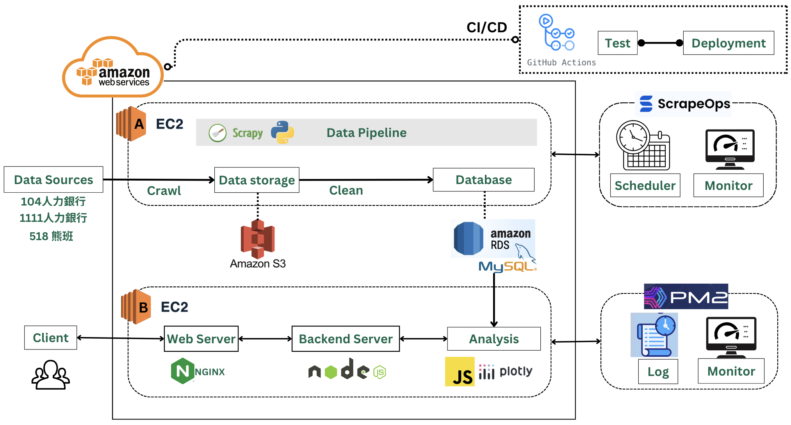

# GoodJob

GoodJob is a platform that analyzes job market trends of engineering, offering visualized statistical reports. Futhermore, It serves for engineers seeking job opportunities, assisting them in securing an ideal good job.

- [Website](https://www.get-good-job.com)
- [Video introduction](https://drive.google.com/file/d/1bH5sI9850xf-Kc5xNKoD5UrVQQ5g55DD/view)

## Table of Contents
- [GoodJob](#goodjob)
  - [Table of Contents](#table-of-contents)
  - [Architecture](#architecture)
  - [Features](#features)
    - [Job API](#job-api)
    - [Data Pipeline](#data-pipeline)
    - [Database/Storage](#databasestorage)
    - [Visualization](#visualization)
    - [Scheduling](#scheduling)
    - [Monitoring](#monitoring)
    - [CI/CD](#cicd)
  - [Contact](#contact)
  
## Architecture

__Overall Architecture__

__Overview__
- Server A: Configured as a Scrapy pipeline, it uses ETLT (Extract, Transform, Load, Transform) techniques to process data scraped from various websites. All the scraped data is stored in an Amazon S3 bucket during the initial transformation phase. After normalization, the data is finally saved into a MySQL database.

* Server B: Designed to handle frontend website layout, it efficiently manages a high volume of client requests using a Node.js environment. The server is interconnected with the same database utilized by Server A, enabling it to access the database tables and retrieve the required data as responses to client requests.

* Monitor: Oversaw data pipeline and server to log errors. Ensured uninterrupted 100% data pipeline completion during scraping using ScrapeOps. Continuously checked frontend website status by PM2 and auto-sent email notifications if server appears any issues.

* DevOps: Utilized GitHub Actions for Continuous Integration (CI) and Continuous Deployment (CD) to verify error-free code passing unit tests. Upon successful test completion, it triggered the next deployment job to initiate the deployment to an AWS EC2 server.

_[Top](#table-of-contents)_

## Features

### Job API

* **Protocol:** `https`

* **Host Name:** `www.get-good-job.com`

* **End Point:** 
  
  `/api/jobs` for All jobs  
  `/api/jobs/ios_engineer` for iOS Engineer jobs  
  `/api/jobs/android_engineer` for Android Engineer jobs  
  `/api/jobs/frontend_engineer` for Frontend Engineer jobs  
  `/api/jobs/backend_engineer` for Backend Engineer jobs  
  `/api/jobs/data_engineer` for Data Engineer jobs  
  `/api/jobs/data_analyst` for Data Analysis jobs  
  `/api/jobs/data_scientist` for Data Scientist jobs  
  `/api/jobs/dba` for Database Administrator jobs  

* **Method:** `GET`

_[Top](#table-of-contents)_

### Data Pipeline
  The data collection process focus on collecting target index, including job title, location, salary, employing company, required skills, education, and experience criteria.

  * Data Sources: These data are sourced from job postings on 104人力銀行, 1111人力銀行, and 518熊班.

  * Scraping: 

  - Scraping
  - Cleaning

_[Top](#table-of-contents)_

### Database/Storage
  - MySQL Schema
  
    | Field | Data Type | Description | 
    | :---: | :---: | :--- |
    | id | Number | Job id. |
    | category | String | Job category. |
    | job_title | String | Job title. |
    | location | String | Job location. |
    | company | String | Employer (hiring company) of the job.  |
    | min_monthly_salary | String | Minimum monthly salary. |
    | max_monthly_salary | String | Maximum monthly salary. |
    | education | String | Required academic qualifications of the job. |
    | skills | String | Required skills of the job. |
    | experience | String | Required working experiences of the job. |
    | job_link | String | Source website link of the job. |
    | source_website | String | Source website name. |

  - S3

_[Top](#table-of-contents)_

### Visualization
  - 

_[Top](#table-of-contents)_

### Scheduling
  - 
_[Top](#table-of-contents)_
  
### Monitoring
  - PM2 - server monitor
  - ScrapyOps - data pipeline monitor

_[Top](#table-of-contents)_

### CI/CD

_[Top](#table-of-contents)_

## Contact

:mailbox: lksh20602@gmail.com

_[Top](#table-of-contents)_